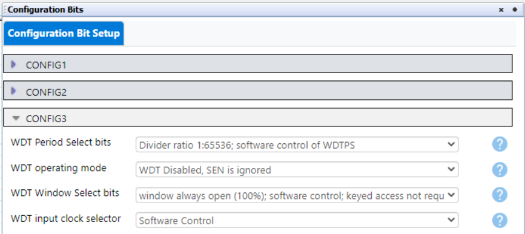
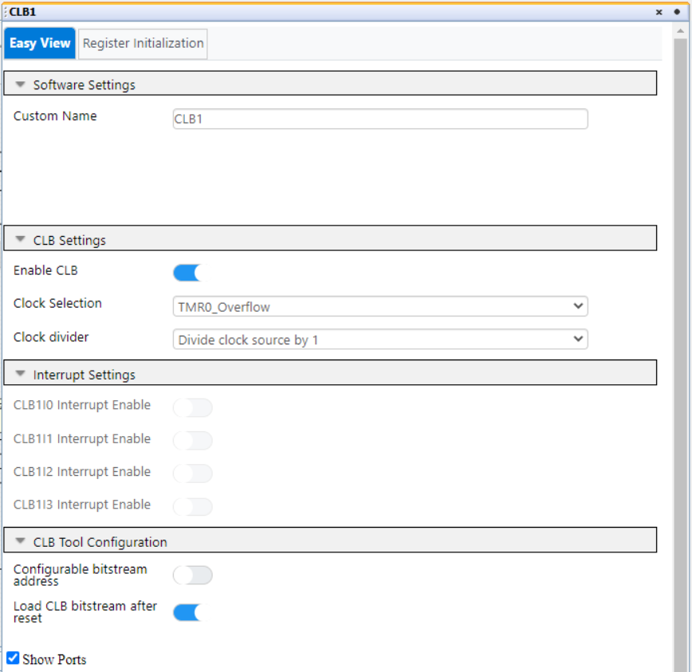
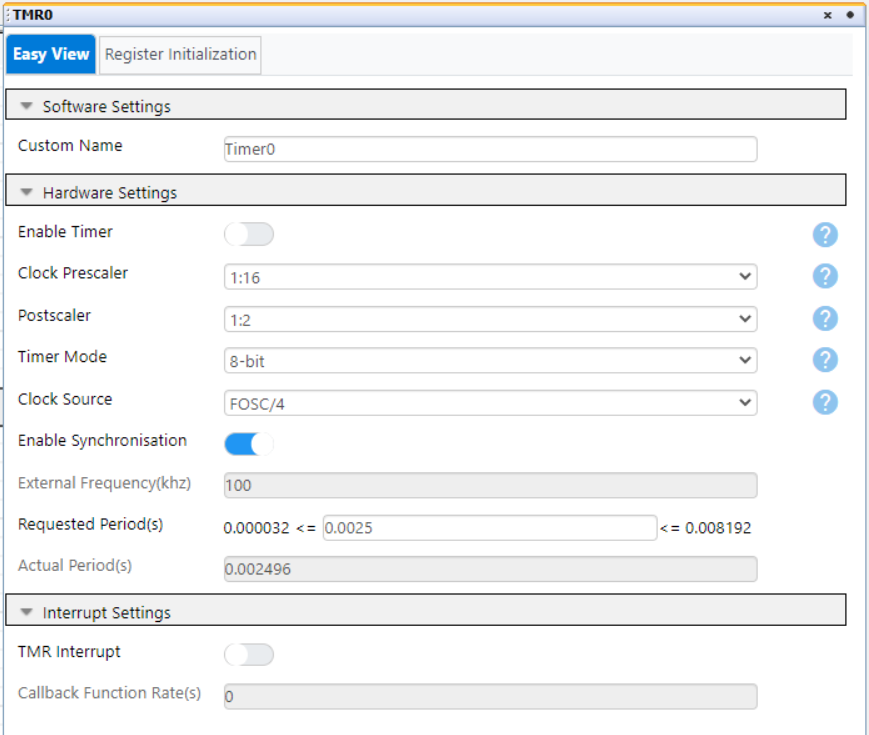
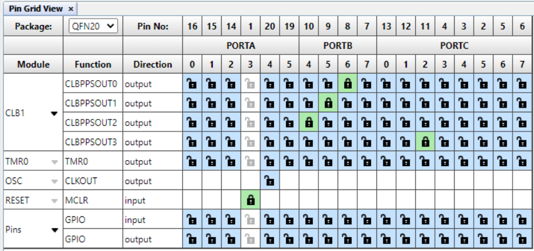

<!-- Please do not change this html logo with link -->

<a target="_blank" href="https://www.microchip.com/" id="top-of-page">
   <picture>
      <source media="(prefers-color-scheme: light)" srcset="images/mchp_logo_light.png" width="350">
      <source media="(prefers-color-scheme: dark)" srcset="images/mchp_logo_dark.png" width="350">
      
   </picture>
</a>

# Metronome Waveform Generator — Use Case for CLB Using the PIC16F13145 Microcontroller With MCC Melody

This repository provides an MPLAB® X project for interfacing the Configurable Logic Block (CLB) and a Switec™ stepper motor. By the end, you will be able to drive a stepper motor to re-create a metronome using the CLB peripheral.

The CLB peripheral is a collection of logic elements that can be programmed to perform a wide variety of digital logic functions. The logic function may be completely combinatorial, sequential, or a combination of the two, enabling users to incorporate hardware-based custom logic into their applications.

## Related Documentation

More details and code examples on the PIC16F13145 can be found at the following links:

- [PIC16F13145 Product Page](https://www.microchip.com/en-us/product/PIC16F13145?utm_source=GitHub&utm_medium=TextLink&utm_campaign=MCU8_PIC16F13145&utm_content=pic16f13145-metronome-mplab-mcc-github&utm_bu=MCU08)
- [PIC16F13145 Code Examples on Discover](https://mplab-discover.microchip.com/v2?dsl=PIC16F13145)
- [PIC16F13145 Code Examples on GitHub](https://github.com/microchip-pic-avr-examples/?q=PIC16F13145)
- [X27.168 Switec Motor Datasheet](https://guy.carpenter.id.au/gaugette/resources/switec/X25_xxx_01_SP_E-1.pdf)

## Software Used

- [MPLAB® X IDE v6.25 or newer](https://www.microchip.com/en-us/tools-resources/develop/mplab-x-ide?utm_source=GitHub&utm_medium=TextLink&utm_campaign=MCU8_PIC16F13145&utm_content=pic16f13145-metronome-mplab-mcc-github&utm_bu=MCU08)
- [MPLAB® XC8 v3.10 or newer](https://www.microchip.com/en-us/tools-resources/develop/mplab-xc-compilers?utm_source=GitHub&utm_medium=TextLink&utm_campaign=MCU8_PIC16F13145&utm_content=pic16f13145-metronome-mplab-mcc-github&utm_bu=MCU08)
- [PIC16F1xxxx_DFP v1.29.444 or newer](https://packs.download.microchip.com/)

**Important:** The current version features an update to the CLB peripheral, which now includes the CLB Synthesizer Library. For migration details and required changes, refer to the [_Troubleshooting MCC Melody Configurable Logic Block (CLB) Projects Configured With CLB v1.x.x_](https://onlinedocs.microchip.com/oxy/GUID-9438FEC3-C80B-4328-8A8E-2531EDEE6155-en-US-1/index.html) migration guide documentation.

## Hardware Used

- The [PIC16F13145 Curiosity Nano Development board](https://www.microchip.com/en-us/development-tool/EV06M52A?utm_source=GitHub&utm_medium=TextLink&utm_campaign=MCU8_PIC16F13145&utm_content=pic16f13145-metronome-mplab-mcc-github&utm_bu=MCU08) is used as a test platform
     

- x27.168 Switec Motor
     

- Logic Analyzer

## Operation

To program the Curiosity Nano board with this MPLAB X project, follow the steps provided in the [How to Program the Curiosity Nano Board](#how-to-program-the-curiosity-nano-board) chapter.  

## Concept

This example demonstrates the capabilities of the CLB, a Core Independent Peripheral (CIP), that can generate the waveforms that drives a Switec stepper motor as a metronome.

The signals needed to drive the Switec stepper motor in both directions are shown in the figure below.
 

A complete rotation (360°) of the rotor corresponds to six clock cycles and to a 2° rotation of the shaft because the Switec motor has a gear train with a reduction ratio of 1/180. The generated waveforms have a frequency six times lower than the CLB clock frequency.

For the counterclockwise movement, the second signal can be derived from the first one by using a one clock delay and a NOT gate. Using the same operations, the third signal can be obtained from the second one.
 
The signals that drive the motor clockwise can be obtained from the signals that drive it counterclockwise, but generated in the opposite direction. This gives us a bidirectional shift register. The figure below shows the implemented solution for waveforms generation.

 

For the metronome functionality, a 6-bit counter is used to determine the number of steps that the metronome does in each direction. The enable signal is obtained from an AND operation between the first signal and one of the other signals that are chosen using a multiplexor. The Most Significant Bit (MSB) of the counter is used to determine the direction of the bidirectional shift register. Using this implementation the motor will run 32 complete steps in each direction. The result will be that the metronome will have an oscillation of 16 steps in each direction.

The implementation of the counter is shown in the figures below.
 
 

 
When the application starts, the shaft of the motor is set to an initial position, so that the oscillation always starts from a fixed position that is symmetrical to the center of the dial. A multiplexor is used to select the input for the bidirectional shift register between the counter output and a CLB Software Input Register (CLBSWIN). The CLBSWIN1 is used to select between METRONOME and FREE_RUN mode, in which the motor will run continuously in one direction. The CLBSWIN0 is used to select between clockwise and counterclockwise movement in FREE_RUN mode.

 

| **SWIN1** | **SWIN0** |  **Mode** |   **Direction**  |
|:---------:|:---------:|:---------:|:----------------:|
|     0     |     0     |  FREE_RUN |     CLOCKWISE    |
|     0     |     1     |  FREE_RUN | COUNTERCLOCKWISE |
|     1     |     0     | METRONOME |         -        |
|     1     |     1     | METRONOME |         -        |

 
The frequency of the metronome is set by the clock input of the CLB. The Switec stepper motor used can run at a frequency between 200 and 600 Hz. This frequency is obtained by using TMR0 overflow as a clock input for the CLB. For this application, the frequency is set to 400 Hz.

For the FREE_RUN mode, used to set the initial position, TMR1 is used to count the steps that the motor does in one direction. This functionality is obtained by using TMR0 overflow as a clock input for TMR1, meaning that six counts of the TMR1 represents one full step of the motor, composed from six partial steps.

 

The figure below shows the waveforms that drive the motor in both directions.
 

## Setup 

The following peripheral and clock configurations are set up using MPLAB Code Configurator (MCC) Melody for the PIC16F13145:

1. Configurations Bits:
    - CONFIG1:
        - External Oscillator mode selection bits: Oscillator not enabled
        - Power-up default value for COSC bits: HFINTOSC (1MHz)
         
    - CONFIG2:
        - Brown-out reset enable bits: Brown-out reset disabled
         
    - CONFIG3:
        - WDT operating mode: WDT Disabled, SEN is ignored
         

2. Clock Control:
    - Clock Source: HFINTOSC
    - HF Internal Clock: 4_MHz
    - Clock Divider: 1
     

3. CLB Synthesizer Library:
    - Clock Divider: Divide clock source by 1
    - Clock Selection: TMR0_Overflow
      

4. CLB1:
    - Enable CLB: Enabled
      

5. TMR0:
    - Timer Enable: Enabled
    - Clock Source: FOSC/4
    - Synchronization Enable: Enabled
    - Prescaler: 1:16
    - Postcaler: 1:2
    - Timer Mode: 8-bit 
    - Requested Period: 2.5 ms
     

6. TMR1:
    - Timer Enable: Disabled
    - Clock Source: TMR0_Overflow
    - Prescaler: 1:1
    - Timer Count Editor Enable: Enabled
    - Timer Count: 0
    - TMR Interrupt Enable: Enabled
       

7. CRC:
    - Auto-configured by the CLB

8. NVM:
    - Auto-configured by the CLB

9. Pin Grid View:
    - CLBPPSOUT0: RB6 (Contact 1)
    - CLBPPSOUT1: RB5 (Contact 2, 3)
    - CLBPPSOUT2: RB4 (Contact 4)
    - CLBPPSOUT3: RC2 (Used to visualize the signal that changes the direction)
      

 

## Demo

  

 

## Summary

This example demonstrates the capabilities of the CLB, a CIP that can generate the waveforms that drive a Switec stepper motor as a metronome.
 

##  How to Program the Curiosity Nano Board

This chapter demonstrates how to use the MPLAB X IDE to program a PIC® device with an Example_Project.X. This is applicable to other projects.

1.  Connect the board to the PC.

2.  Open the Example_Project.X project in MPLAB X IDE.

3.  Set the Example_Project.X project as main project.
     Right click the project in the **Projects** tab and click **Set as Main Project**.
     

4.  Clean and build the Example_Project.X project.
     Right click the Example_Project.X project and select **Clean and Build**.
     

5.  Select **PICxxxxx Curiosity Nano** in the Connected Hardware Tool section of the project settings:
     Right click the project and click **Properties**.
     Click the arrow under the Connected Hardware Tool.
     Select **PICxxxxx Curiosity Nano** (click the **SN**), click **Apply** and then click **OK**.
     

6.  Program the project to the board.
     Right click the project and click **Make and Program Device**.
     

 

- - - 
## Menu
- [Back to Top](#metronome-waveform-generator--use-case-for-clb-using-the-pic16f13145-microcontroller-with-mcc-melody)
- [Back to Related Documentation](#related-documentation)
- [Back to Software Used](#software-used)
- [Back to Hardware Used](#hardware-used)
- [Back to Operation](#operation)
- [Back to Concept](#concept)
- [Back to Setup](#setup)
- [Back to Demo](#demo)
- [Back to Summary](#summary)
- [Back to How to Program the Curiosity Nano Board](#how-to-program-the-curiosity-nano-board)